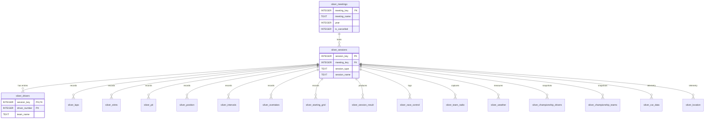

# F1 Reality Check: Data Dictionary
 
Reference document for the **silver layer** of `f1.db`. All 18 tables described in the order I'll typically join them in.
 
Silver is the cleaned, typed, PK-enforced view of the raw OpenF1 data. Bronze (the unprefixed source tables) is preserved but not queried directly for analysis. For each table below: prose intro, note on what changed from bronze, column table, and any quirks worth knowing before i write queries against it.

## Table of Contents
 
- [Data Model Overview](#data-model-overview)
- [Core Structural Tables](#core-structural-tables)
  - [silver_meetings](#silver_meetings)
  - [silver_sessions](#silver_sessions)
  - [silver_drivers](#silver_drivers)
- [Race Event Tables](#race-event-tables)
  - [silver_laps](#silver_laps)
  - [silver_stints](#silver_stints)
  - [silver_pit](#silver_pit)
  - [silver_position](#silver_position)
  - [silver_intervals](#silver_intervals)
  - [silver_overtakes](#silver_overtakes)
- [Session Metadata & Results](#session-metadata--results)
  - [silver_starting_grid](#silver_starting_grid)
  - [silver_session_result](#silver_session_result)
  - [silver_race_control](#silver_race_control)
  - [silver_team_radio](#silver_team_radio)
  - [silver_weather](#silver_weather)
- [Championship Standings](#championship-standings)
  - [silver_championship_drivers](#silver_championship_drivers)
  - [silver_championship_teams](#silver_championship_teams)
- [Telemetry](#telemetry)
  - [silver_car_data](#silver_car_data)
  - [silver_location](#silver_location)
- [The Story of a Season](#the-story-of-a-season)

## Data Model Overview
 
Everything anchors on two keys: **`meeting_key`** (a race weekend) and **`session_key`** (a specific session within that weekend, Practice 1, Qualifying, Race, etc.). Almost every table below carries one or both.
 

 
**Read this as:** one meeting has many sessions; each session has entries for many drivers and produces many laps, positions, radios, etc.
 
Rows are cheap to add in silver but keys are the discipline, every analytical query starts by picking a `session_key` (or a range of them via meeting/year) and joining outward from there.

## Core Structural Tables
 
### `silver_meetings`
 
A **meeting** is a full race weekend, Bahrain GP, Monaco GP, etc. Contains everything about *where and when*: circuit, country, dates, timezone. One row per race weekend, 100 total across 2023–2026.
 
**What changed from bronze:** all keys and `year` cast to INTEGER; `is_cancelled` converted from `'True'`/`'False'` strings to 0/1 with a CHECK constraint; NOT NULL declared everywhere (no nulls exist).
 
| Column | Type | Nullable | Notes |
|---|---|---|---|
| `meeting_key` | INTEGER PK | No | Stable across F1 seasons |
| `meeting_name` | TEXT | No | Short name, e.g. "Monaco Grand Prix" |
| `meeting_official_name` | TEXT | No | Full name with sponsor, e.g. "FORMULA 1 GRAND PRIX DE MONACO 2024" |
| `location` | TEXT | No | City, e.g. "Monte Carlo" |
| `country_key` | INTEGER | No | Stable country ID |
| `country_code` | TEXT | No | 3-letter ISO code |
| `country_name` | TEXT | No | Full name |
| `country_flag` | TEXT | No | URL to flag image (metadata, not analytical) |
| `circuit_key` | INTEGER | No | Stable circuit ID |
| `circuit_short_name` | TEXT | No | e.g. "Monaco", "Silverstone" |
| `circuit_type` | TEXT | No | Track category |
| `circuit_info_url` | TEXT | No | URL, metadata only |
| `circuit_image` | TEXT | No | URL, metadata only |
| `gmt_offset` | TEXT | No | Format `"HH:MM:SS"` or `"-HH:MM:SS"`. Kept as text; convert to seconds on the fly if needed |
| `date_start` | TEXT | No | ISO 8601 UTC, first session of the weekend |
| `date_end` | TEXT | No | ISO 8601 UTC, last session |
| `year` | INTEGER | No | 2023–2026 |
| `is_cancelled` | INTEGER | No | 0 or 1 (3 meetings cancelled across the range) |
 

### `silver_sessions`
 
A **session** is one on-track period within a weekend, Practice 1, Practice 2, Qualifying, Race, Sprint, etc. 490 rows. `session_key` is the atomic unit for almost everything else; if a table has data about "what happened," it's keyed on session_key.
 
**What changed from bronze:** all keys cast to INTEGER; `is_cancelled` normalized; CHECK constraint on `session_type` limits it to the 3 known values.
 
| Column | Type | Nullable | Notes |
|---|---|---|---|
| `session_key` | INTEGER PK | No | The atomic unit — every analytical join starts here |
| `session_type` | TEXT | No | `Practice`, `Race`, or `Qualifying` (CHECK enforced). Note: Sprint sessions appear as `Race` or `Qualifying` with disambiguating `session_name` |
| `session_name` | TEXT | No | e.g. `Practice 1`, `Sprint`, `Sprint Qualifying`, `Race`, `Day 1` (for pre-season testing) |
| `date_start` | TEXT | No | ISO 8601 UTC |
| `date_end` | TEXT | No | ISO 8601 UTC |
| `meeting_key` | INTEGER FK | No | → `silver_meetings.meeting_key` |
| `circuit_key` | INTEGER | No | Denormalized from meetings for join convenience |
| `circuit_short_name` | TEXT | No | Denormalized |
| `country_key` | INTEGER | No | Denormalized |
| `country_code` | TEXT | No | Denormalized |
| `country_name` | TEXT | No | Denormalized |
| `location` | TEXT | No | Denormalized |
| `gmt_offset` | TEXT | No | Denormalized |
| `year` | INTEGER | No | Denormalized |
| `is_cancelled` | INTEGER | No | 0 or 1 (15 sessions cancelled — usually weather) |
 
**Watch out:** the same `session_name` can mean different things across years as F1 renames things (e.g. "Sprint Shootout" → "Sprint Qualifying" in 2024). Filter on `session_type` when you can, `session_name` only when you must.

### `silver_drivers`
 
**One row per driver per session.** Same driver in different sessions = different rows. 9,949 rows total. Composite PK `(session_key, driver_number)`.
 
**What changed from bronze:** all keys cast to INTEGER; NULL allowed for the name-related columns because 14 rows (test/reserve drivers) have missing personal metadata but valid team info.
 
country_code availability: populated for 2023–2024 (with 14 systemic nulls in a single 2023 test session), fully NULL for 2025–2026. Cause unknown, appears OpenF1 stopped populating the field starting 2025.

| Column | Type | Nullable | Notes |
|---|---|---|---|
| `session_key` | INTEGER PK,FK | No | → `silver_sessions.session_key` |
| `driver_number` | INTEGER PK | No | Same driver typically keeps the same number for their career |
| `meeting_key` | INTEGER | No | Denormalized for convenience |
| `broadcast_name` | TEXT | Yes | e.g. "M VERSTAPPEN" |
| `full_name` | TEXT | Yes | e.g. "Max VERSTAPPEN" |
| `name_acronym` | TEXT | Yes | 3-letter code, e.g. "VER" (14 nulls for reserve/test drivers) |
| `team_name` | TEXT | No | e.g. "Red Bull Racing", "Aston Martin". Watch spelling drift across seasons |
| `team_colour` | TEXT | No | 6-char hex without leading `#`, e.g. `"229971"` for Aston Martin |
| `first_name` | TEXT | Yes | Nullable, same 14 rows |
| `last_name` | TEXT | Yes | Nullable, same 14 rows |
| `headshot_url` | TEXT | Yes | 347 nulls |
| `country_code` | TEXT | Yes | 3-letter, e.g. "NED"; 5,240 nulls (majority) |
 
**Team names change year over year** as F1 changes sponsors (e.g. "AlphaTauri" → "RB" → "Racing Bulls"). Group by `team_name` at the peril for multi-year analysis; consider a manual mapping.

## Race Event Tables
 
### `silver_laps`
 
**One row per driver per lap per session.** 217,692 rows — the largest analytical table. Contains sector times, speeds at the intermediates and speed trap, and pit-out flag. This is where the most granular pace analysis lives.
 
**What changed from bronze:** keys cast to INTEGER; all durations and speeds cast to REAL; `is_pit_out_lap` normalized to 0/1/NULL; segment arrays kept as JSON strings.
 
| Column | Type | Nullable | Notes |
|---|---|---|---|
| `session_key` | INTEGER PK,FK | No | |
| `driver_number` | INTEGER PK | No | |
| `lap_number` | INTEGER PK | No | Starts at 1 |
| `meeting_key` | INTEGER | No | Denormalized |
| `date_start` | TEXT | Yes | ISO 8601 UTC when the lap started; 448 nulls (session-start artifacts) |
| `duration_sector_1` | REAL | Yes | Seconds. 19,751 nulls (out-laps, invalidated laps) |
| `duration_sector_2` | REAL | Yes | Seconds. 2,088 nulls |
| `duration_sector_3` | REAL | Yes | Seconds. 5,789 nulls (red-flagged laps) |
| `i1_speed` | REAL | Yes | km/h at intermediate 1 speed trap |
| `i2_speed` | REAL | Yes | km/h at intermediate 2 |
| `st_speed` | REAL | Yes | km/h at start/finish speed trap. 14,354 nulls |
| `lap_duration` | REAL | Yes | Seconds. 8,279 nulls (incomplete laps). Range observed: 60.35s to 3510.47s (the max is a red-flag/safety-car lap, real value) |
| `is_pit_out_lap` | INTEGER | Yes | 0/1/NULL. 2,269 nulls. Being CHECK-constrained to `(0,1) OR NULL` |
| `segments_sector_1` | TEXT | Yes | JSON array of mini-sector status codes (colored segments) |
| `segments_sector_2` | TEXT | Yes | Same |
| `segments_sector_3` | TEXT | Yes | Same |
 
**Segment codes**: values like `[2064, 2064, 2049, ...]` are OpenF1's mini-sector status codes (yellow/green/purple flag comparisons vs session best). Not lap times. Decode in gold if you need them.
 
**Null pattern**: sector times and speed traps are recorded by separate systems. duration_sector_N nulls do NOT imply corresponding iN_speed nulls, or vice versa. Each column's null status should be checked independently.

**Data quality note:** the 3,510-second "lap" is real — it's a car sitting under a red flag. Don't filter these in silver; filter in gold with `WHERE lap_duration BETWEEN 60 AND 300` or similar depending on the analysis.
 

### `silver_stints`
 
**One row per driver per continuous tyre stint.** A stint starts on a fresh (or used) set of tyres and ends when the driver pits. 31,033 rows.
 
**What changed from bronze:** keys and lap numbers cast to INTEGER; `tyre_age_at_start` cast to INTEGER; no CHECK constraint on `compound` because the value set includes fallback values like `UNKNOWN` and `TEST_UNKNOWN`.
 
| Column | Type | Nullable | Notes |
|---|---|---|---|
| `session_key` | INTEGER PK,FK | No | |
| `driver_number` | INTEGER PK | No | |
| `stint_number` | INTEGER PK | No | 1 = first stint of the session. Max observed: 33 (a chaotic session with many red flags) |
| `meeting_key` | INTEGER | No | Denormalized |
| `lap_start` | INTEGER | Yes | First lap of the stint. 106 nulls (never-started stints) |
| `lap_end` | INTEGER | Yes | Last lap of the stint. 106 nulls |
| `compound` | TEXT | Yes | `SOFT`, `MEDIUM`, `HARD`, `INTERMEDIATE`, `WET`, `UNKNOWN`, `TEST_UNKNOWN`. 80 nulls |
| `tyre_age_at_start` | INTEGER | Yes | Laps already on this tyre set when the stint began. 22 nulls |
 
**Quirk:** Normal to see rows where `lap_end < lap_start` (24 rows total). Two patterns: (a) `lap_end = lap_start - 1` means the stint started a lap but the driver retired/pitted before completing it; (b) `lap_start = 1, lap_end = 0` are phantom stints from cancelled sessions. Both are real, silver preserves them, gold should filter with `WHERE lap_end >= lap_start` for "real" stints.

### `silver_pit`
 
**One row per pit stop.** 26,791 rows. Records how long the stop took — three different measurements.
 
**What changed from bronze:** keys and durations properly typed.
 
| Column | Type | Nullable | Notes |
|---|---|---|---|
| `session_key` | INTEGER PK,FK | No | |
| `driver_number` | INTEGER PK | No | |
| `lap_number` | INTEGER PK | No | Lap on which the pit occurred |
| `meeting_key` | INTEGER | No | Denormalized |
| `date` | TEXT | No | ISO 8601 UTC of the stop |
| `stop_duration` | REAL | Yes | Stationary time in the pit box (tyre change proper). 25,830 nulls — F1 timing doesn't always report this separately |
| `lane_duration` | REAL | Yes | Total time in the pit lane (entry to exit). 6,046 nulls |
| `pit_duration` | REAL | Yes | Total time lost vs staying on track. 6,046 nulls |
 
**Quirk:** `pit_duration` max is **16,921 seconds** (~4.7 hours). That's a car sitting in the pit lane during a red-flag suspension. Real value with a special meaning; filter in gold if it distorts averages.

### `silver_position`
 
**A time-series of every position change.** 281,801 rows. Each row = a driver was in position X at timestamp Y.
 
**What changed from bronze:** switched to a synthetic auto-increment PK because 68 timestamps have same-driver-same-second duplicates (data artifacts). Index on `(session_key, driver_number, "date")` for the natural access pattern.
 
| Column | Type | Nullable | Notes |
|---|---|---|---|
| `id` | INTEGER PK AUTOINCREMENT | No | Synthetic, no meaning |
| `session_key` | INTEGER FK | No | Indexed |
| `driver_number` | INTEGER | No | Indexed |
| `meeting_key` | INTEGER | No | Denormalized |
| `date` | TEXT | No | ISO 8601 UTC. Indexed |
| `position` | INTEGER | No | 1–23 observed. Above 20 = reserve drivers in testing sessions |

### `silver_intervals`
 
**Live gap data during a race**, sampled roughly every 4 seconds. 1,875,432 rows — the second-largest table after telemetry.
 
**What changed from bronze:** the raw `interval` and `gap_to_leader` columns contained a mix of numeric strings ("1.234") and lap-deficit strings ("+1 LAP", "+2 LAPS"). Silver splits each into two columns: a REAL for seconds and an INTEGER for lap deficit. Exactly one of each pair is non-null per row.
 
| Column | Type | Nullable | Notes |
|---|---|---|---|
| `session_key` | INTEGER PK,FK | No | |
| `driver_number` | INTEGER PK | No | |
| `date` | TEXT PK | No | ISO 8601 UTC |
| `meeting_key` | INTEGER | No | Denormalized |
| `interval_seconds` | REAL | Yes | Gap in seconds to the car directly ahead. NULL if driver is lapped by that car |
| `interval_laps` | INTEGER | Yes | Lap deficit to the car ahead. NULL if not lapped |
| `gap_to_leader_seconds` | REAL | Yes | Gap in seconds to the race leader. NULL if driver is lapped by leader |
| `gap_to_leader_laps` | INTEGER | Yes | Lap deficit to the race leader. NULL if not lapped |
 
**Being lapped by the car directly ahead is rare** (only 65 rows). Being lapped by the leader is common (170,696 rows, ~9%). If you compute average gaps naively over the whole table, remember that "+1 LAP" cases become NULL and drop out — that could bias the averages if lapped drivers matter.

### `silver_overtakes`
 
**One row per pairwise position swap.** 20,065 rows. Includes on-track overtakes, pit-cycle position gains, and post-race penalty position swaps.
 
**What changed from bronze:** the PK required a fix — the initial hypothesis was `(session_key, date, overtaking_driver_number)` but 2,018 rows violate that (a driver overtaking multiple cars at the same recorded timestamp, e.g. in a first-lap melee). Real PK is 4 columns: `(session_key, date, overtaking_driver_number, overtaken_driver_number)`.
 
| Column | Type | Nullable | Notes |
|---|---|---|---|
| `session_key` | INTEGER PK,FK | No | |
| `date` | TEXT PK | No | ISO 8601 UTC |
| `overtaking_driver_number` | INTEGER PK | No | The one gaining position |
| `overtaken_driver_number` | INTEGER PK | No | The one losing position (CHECK: != overtaking) |
| `meeting_key` | INTEGER | No | Denormalized |
| `position` | INTEGER | No | The position gained by the overtaker |
 
**Not all "overtakes" are on-track passes.** OpenF1's own docs warn the data can be incomplete. Remember , Cross-reference with `silver_position` timestamps if i need real racing overtakes vs strategic gains.

## Session Metadata & Results
 
### `silver_starting_grid`
 
**Where each driver started the race.** 1,814 rows (only for Race and Sprint sessions).
 
**What changed from bronze:** keys and lap time cast to numeric types.
 
| Column | Type | Nullable | Notes |
|---|---|---|---|
| `session_key` | INTEGER PK,FK | No | |
| `driver_number` | INTEGER PK | No | |
| `meeting_key` | INTEGER | No | Denormalized |
| `position` | INTEGER | No | 1 = pole, up to 22 observed |
| `lap_duration` | REAL | Yes | The qualifying lap time that earned this grid slot, in seconds. 70 nulls (drivers who didn't set a time) |

### `silver_session_result`
 
**Final classification of each driver per session.** 7,660 rows. This is the answer to "who finished where."
 
**What changed from bronze:** DNF/DNS/DSQ normalized to 0/1; gap_to_leader split into seconds/laps like intervals; points cast to REAL.
 
| Column | Type | Nullable | Notes |
|---|---|---|---|
| `session_key` | INTEGER PK,FK | No | |
| `driver_number` | INTEGER PK | No | |
| `meeting_key` | INTEGER | No | Denormalized |
| `position` | INTEGER | Yes | Finishing position. 267 nulls (DNS drivers) |
| `number_of_laps` | INTEGER | Yes | Laps completed. 8 nulls |
| `dnf` | INTEGER | No | 0/1. 255 DNFs total |
| `dns` | INTEGER | No | 0/1. 25 DNSs total |
| `dsq` | INTEGER | No | 0/1. 9 DSQs total |
| `duration` | REAL | Yes | Ambiguous: fastest lap time in quali/practice, total race time in races |
| `gap_to_leader_seconds` | REAL | Yes | Seconds behind winner. NULL if lapped |
| `gap_to_leader_laps` | INTEGER | Yes | Lap deficit. NULL if not lapped |
| `points` | REAL | Yes | 5,801 nulls (practice/quali have no points). Race max observed: 26 |
 
**Points column is the prediction target's raw material.** Aggregate over Race and Sprint sessions by team to get constructor standings.

### `silver_race_control`
 
**Every message the race director sends** — flags, safety car deployments, penalty notifications, DRS enabled/disabled, session status changes. 19,807 rows.
 
**What changed from bronze:** synthetic id PK (natural key wasn't unique — 42 timestamp collisions from simultaneous flag events); CHECK constraints on `category`, `scope`, `qualifying_phase` since those enum sets are stable and small.
 
| Column | Type | Nullable | Notes |
|---|---|---|---|
| `id` | INTEGER PK AUTOINCREMENT | No | Synthetic |
| `session_key` | INTEGER FK | No | Indexed |
| `meeting_key` | INTEGER | No | Denormalized |
| `date` | TEXT | No | Indexed |
| `driver_number` | INTEGER | Yes | Only populated when message targets a specific driver |
| `lap_number` | INTEGER | Yes | Only populated when message occurred during a lap |
| `category` | TEXT | No | CHECK: `Flag`, `Other`, `SessionStatus`, `Drs`, `SafetyCar`, `CarEvent` |
| `flag` | TEXT | Yes | `CLEAR`, `BLUE`, `YELLOW`, `DOUBLE YELLOW`, `GREEN`, `RED`, `CHEQUERED`, `BLACK AND WHITE`. NULL when category ≠ Flag |
| `scope` | TEXT | Yes | CHECK: `Sector`, `Driver`, `Track`. NULL when not a flag |
| `sector` | INTEGER | Yes | 1/2/3. Only for sector-scoped flags |
| `qualifying_phase` | INTEGER | Yes | CHECK: 1/2/3 (Q1/Q2/Q3). Only for qualifying events |
| `message` | TEXT | No | Free-text human-readable message |
 
**Read this table like a live race feed** — join to `silver_laps` on session_key + date range to see what was happening during any given lap.

### `silver_team_radio`
 
**Team radio audio clips.** 15,575 rows. Contains URLs to the audio, not transcriptions.
 
**What changed from bronze:** synthetic id PK + UNIQUE constraint on `(session_key, driver_number, date)` — chose this pattern for scalability. `recording_url` is also unique in practice but making it the PK would be fragile (F1 could rename files).
 
| Column | Type | Nullable | Notes |
|---|---|---|---|
| `id` | INTEGER PK AUTOINCREMENT | No | |
| `session_key` | INTEGER | No | Part of UNIQUE constraint |
| `driver_number` | INTEGER | No | Part of UNIQUE constraint |
| `date` | TEXT | No | Part of UNIQUE constraint |
| `meeting_key` | INTEGER | No | Denormalized |
| `recording_url` | TEXT | No | URL to the audio file |

### `silver_weather`
 
**Track and air conditions**, sampled roughly every minute per session. 42,915 rows.
 
**What changed from bronze:** all measurements typed as REAL/INTEGER; `rainfall` confirmed as 0/1 boolean flag; CHECK on `wind_direction` (0-360°); 88 fully-identical duplicate rows collapsed with `SELECT DISTINCT` on insert (raw had 43,003).
 
| Column | Type | Nullable | Notes |
|---|---|---|---|
| `session_key` | INTEGER PK,FK | No | |
| `date` | TEXT PK | No | ISO 8601 UTC |
| `meeting_key` | INTEGER | No | Denormalized |
| `humidity` | REAL | No | Percentage 9-96 observed |
| `pressure` | REAL | No | hPa. 778-1031 observed (778 = high-altitude Mexico City) |
| `rainfall` | INTEGER | No | 0/1 flag. ~4% of samples show rain |
| `track_temperature` | REAL | No | °C. -16.5 to 60.6 observed |
| `air_temperature` | REAL | No | °C. 10.7 to 35.8 observed |
| `wind_speed` | REAL | No | m/s. 0 to 7.3 observed |
| `wind_direction` | INTEGER | No | Degrees 0-360 (CHECK enforced) |
 
**Rainfall is a state, not an amount.** You can't sum it. To measure "how wet was this session" use `SUM(rainfall) / COUNT(*)` for percentage of samples with rain.

## Championship Standings
 
### `silver_championship_drivers`
 
**Snapshot of the driver standings before and after each session.** 2,098 rows. Beta endpoint on OpenF1.
 
**What changed from bronze:** all keys/points/positions typed properly.
 
| Column | Type | Nullable | Notes |
|---|---|---|---|
| `session_key` | INTEGER PK,FK | No | |
| `driver_number` | INTEGER PK | No | |
| `meeting_key` | INTEGER | No | Denormalized |
| `position_start` | INTEGER | Yes | Standings before session; 63 nulls (first sessions of a season) |
| `position_current` | INTEGER | No | Standings after session |
| `points_start` | REAL | No | Points before session |
| `points_current` | REAL | No | Points after session |

### `silver_championship_teams`
 
**Same, at the constructor level.** 1,001 rows. **This is the direct raw material for the prediction target** — team standings evolving race by race.
 
| Column | Type | Nullable | Notes |
|---|---|---|---|
| `session_key` | INTEGER PK,FK | No | |
| `team_name` | TEXT PK | No | Watch year-to-year name drift |
| `meeting_key` | INTEGER | No | Denormalized |
| `position_start` | INTEGER | Yes | 30 nulls (first sessions) |
| `position_current` | INTEGER | No | |
| `points_start` | REAL | No | |
| `points_current` | REAL | No | Max observed: 860 |

## Telemetry
 
### `silver_car_data`
 
**Per-tick car telemetry**, ~3.7Hz per driver per session. 9,365,942 rows. Only 32/490 sessions have this data — OpenF1's historical telemetry isn't comprehensive.
 
**What changed from bronze:** everything cast to INTEGER; no CHECK constraints on `n_gear` (~600 rows have corrupt values above 8, preserved for gold to filter).
 
| Column | Type | Nullable | Notes |
|---|---|---|---|
| `session_key` | INTEGER PK,FK | No | |
| `driver_number` | INTEGER PK | No | |
| `date` | TEXT PK | No | ISO 8601 UTC with sub-millisecond precision |
| `meeting_key` | INTEGER | No | Denormalized |
| `throttle` | INTEGER | No | 0-104. Not a smooth 0-100; F1's "full throttle" marker is 104 |
| `brake` | INTEGER | No | 0, 100, or 104. Essentially binary in practice |
| `rpm` | INTEGER | No | 0-13,400 observed |
| `speed` | INTEGER | No | km/h. 0-359 observed |
| `n_gear` | INTEGER | No | 0-8 for real values; ~600 rows show 9-128 (telemetry corruption) |
| `drs` | INTEGER | Yes | 0/1/8 = disabled, 10/12/14 = active, 9 = undocumented. 570,856 nulls |

### `silver_location`
 
**Per-tick x/y/z coordinates**, same sampling as car_data. 25,849,231 rows — the largest table by far. Only some sessions have telemetry.
 
**Coordinates are in millimeters relative to the circuit's local origin.** Observed ranges: x ±17m, y ±18m, z -0.25 to 22m. z includes elevation (kerbs, hills, banking).
 
| Column | Type | Nullable | Notes |
|---|---|---|---|
| `session_key` | INTEGER PK,FK | No | |
| `driver_number` | INTEGER PK | No | |
| `date` | TEXT PK | No | |
| `meeting_key` | INTEGER | No | Denormalized |
| `x` | INTEGER | No | mm |
| `y` | INTEGER | No | mm |
| `z` | INTEGER | No | mm (elevation) |

## The Story of a Season
 
Follow one row of data from creation to storage. This is how a single season lives inside `f1.db`.
 
**Late February — Pre-season testing in Bahrain.** F1 shows up at Sakhir for three days of running. The moment testing is confirmed, OpenF1 registers a new **meeting** — a row lands in `silver_meetings` with a new `meeting_key`, the country ("Bahrain"), the circuit ("Sakhir"), the dates, and `is_cancelled = 0`. Nothing else exists yet.
 
**Day 1 of testing begins.** A single test session is created — one row in `silver_sessions` with `session_type = 'Practice'`, `session_name = 'Day 1'`. Ten teams roll their cars out. Twenty (sometimes more) driver entries populate `silver_drivers` — one row per driver per session, capturing their car number, team, colour. Reserve drivers get their turn on Day 2 and Day 3 — new rows in `silver_drivers` for the same drivers under new session_keys.
 
**A car goes out on track.** As the car reaches the pit exit, `silver_car_data` starts writing — 3-4 rows per second per driver, capturing throttle, brake, rpm, speed, gear. At the same moment, `silver_location` starts writing x/y/z coordinates at the same rate. Every 60 seconds or so, `silver_weather` gets a fresh row: air temp, track temp, humidity, whether it's raining. The car crosses the start/finish line for the first time — a row lands in `silver_laps` with lap_number = 1, sector times, i1/i2/st speeds, and `is_pit_out_lap = 1`. A `silver_stints` row registers the tyres they went out on. If the driver messages the pit wall over the radio, `silver_team_radio` records the audio URL.
 
**Race control flags a moment.** A yellow flag in Sector 2? A row goes into `silver_race_control` with `category = 'Flag'`, `flag = 'YELLOW'`, `scope = 'Sector'`, `sector = 2`. Later that day: `flag = 'CHEQUERED'`, marking the end of the day's running.
 
**March — the first race weekend.** The season proper begins. New meeting, new sessions, this time including proper Practice 1/2/3, Qualifying, and Race — five session rows in `silver_sessions` for the weekend. Drivers register for each of the five, creating five new rows per driver in `silver_drivers`.
 
**Qualifying happens on Saturday.** Fastest lap per driver per Q1/Q2/Q3 gets tracked in `silver_laps`. Race control logs when Q1 starts/ends (`qualifying_phase = 1`), same for Q2 and Q3. At the end, `silver_session_result` records where each driver finished — no points here, just finishing positions and their fastest lap time in `duration`. That result determines the grid for tomorrow — a fresh set of 20 rows in `silver_starting_grid` with `position` 1 through 20 and each driver's qualifying `lap_duration`.
 
**Sunday morning: the race.** The formation lap begins — `silver_car_data` and `silver_location` start streaming for the race session. Lights go out at ~14:00 local time. First lap: chaos in Turn 1. A driver overtakes three cars at once through the run to Turn 2 — three rows in `silver_overtakes`, all with the same `date` (timestamp resolution can't separate them), each row a distinct `overtaking → overtaken` pair. Same event triggers rows in `silver_position` for every affected driver, each capturing their new position.
 
**Lap by lap.** Every driver completes a lap — one row each in `silver_laps` with sector times and speeds. Every ~4 seconds, `silver_intervals` captures the gap to the car ahead (`interval_seconds`) and to the leader (`gap_to_leader_seconds`). If a driver gets lapped by the leader, their next `silver_intervals` row shows `gap_to_leader_seconds = NULL` and `gap_to_leader_laps = 1` instead.
 
**A pit stop.** Driver enters the pit lane on lap 18. A row lands in `silver_pit` with lap_number = 18, `pit_duration` capturing the time lost. The current stint ends (silver_stints row updated with `lap_end = 17`), and a new stint begins (new row, `stint_number = 2`, `lap_start = 19`, new `compound`). If the stop was disastrous — 20 seconds instead of 2 — `stop_duration` reflects that.
 
**Rain arrives.** Weather station catches it: `silver_weather` row shows `rainfall = 1`, humidity spikes. Cars pit for intermediates over the next few laps — new stints all round with `compound = 'INTERMEDIATE'`. Race control might deploy a Safety Car — row in `silver_race_control` with `category = 'SafetyCar'`.
 
**The chequered flag.** Race control writes the final `Flag` row (`flag = 'CHEQUERED'`). `silver_session_result` gets 20 new rows — one per driver — with finishing positions, gap to leader, DNF flags, and **points**. The winning constructor gets a bump: `silver_championship_teams` gets a new row for the session with updated `points_current` and updated `position_current`. Same for drivers in `silver_championship_drivers`.
 
**Between races.** Nothing happens for two weeks. `silver_championship_teams` carries forward the standings — when the next race's first practice starts, its `position_start` and `points_start` will match what `position_current` and `points_current` say at the end of the previous race's Race session.
 
**And repeat.** For 23-24 race weekends. By December, `silver_sessions` has ~110-120 rows for the year, `silver_laps` has ~50,000, `silver_intervals` has ~400,000, and `silver_championship_teams` has ~50 snapshots showing exactly how the constructor battle unfolded, session by session, from Bahrain to Abu Dhabi.
 
That last table is where the prediction model lives. Everything else is context, features, and evidence.

F1 - reality - check - data - dictionary
